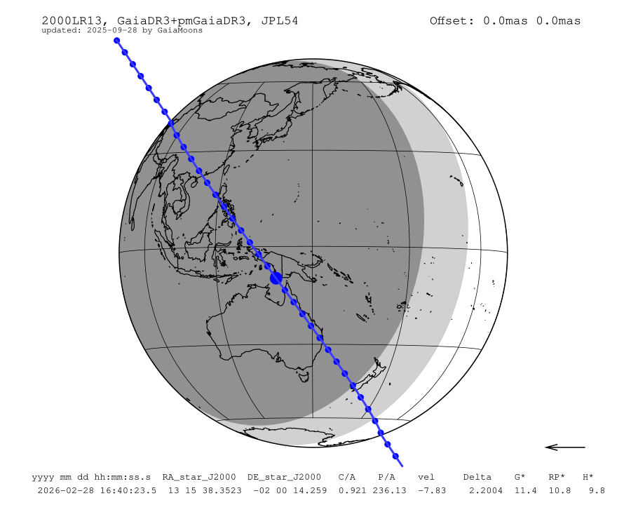
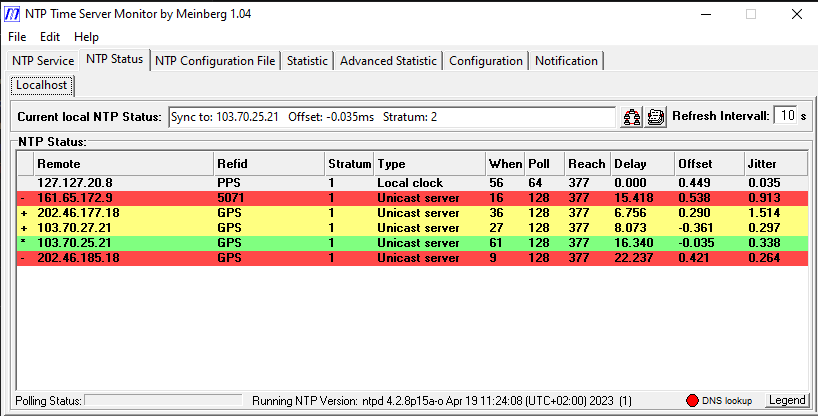
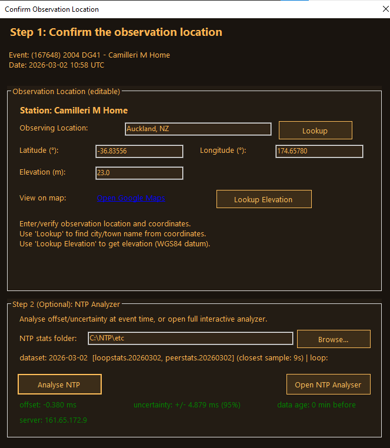
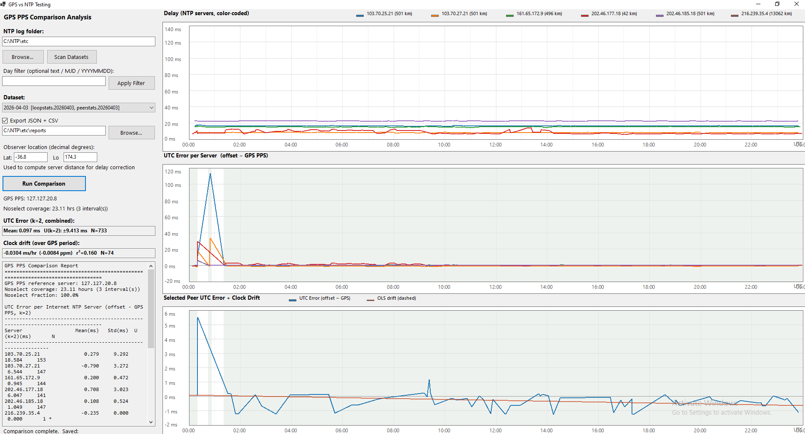
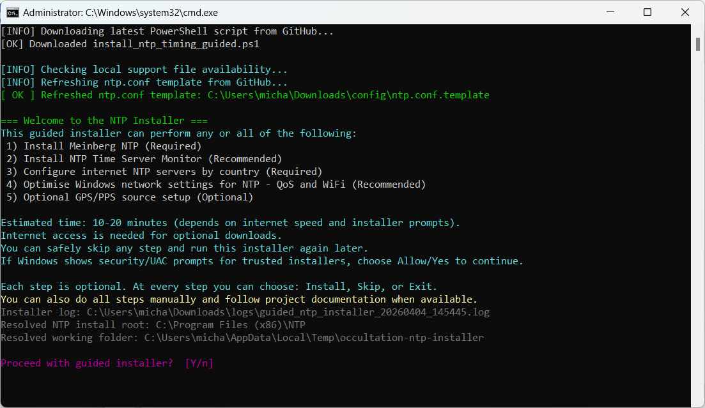
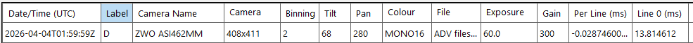
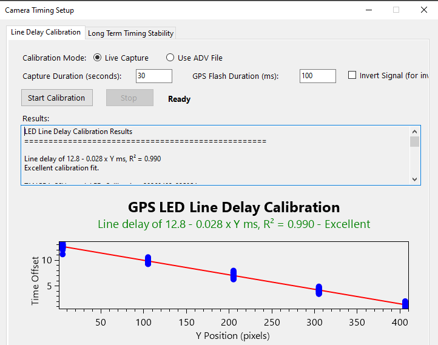
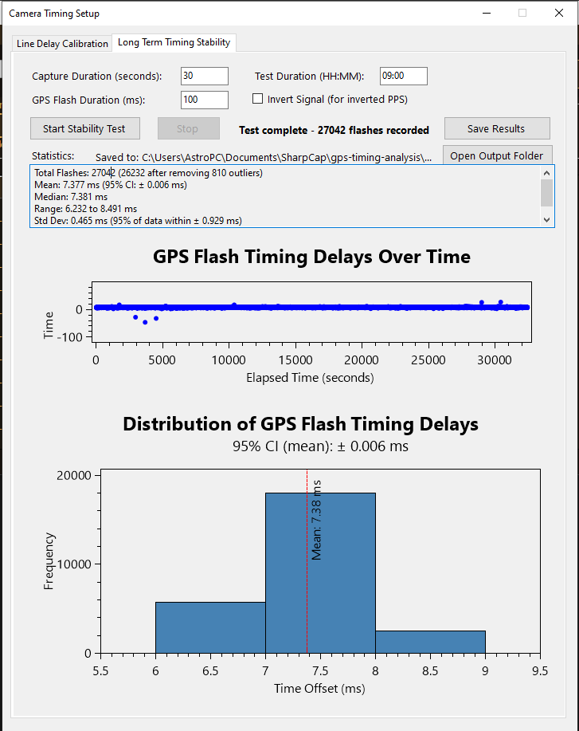

<!-- _paginate: false -->
<!-- _class: hook -->

    

# No observations.

Not because no one had a camera.

**Because no one thought they could time it.**

---

# The assumed path

Most people researching occultation timing find this:

1. *"You need a GPS timing device..."*
2. *"Or an analog camera and VTI..."*
3. *"Or a dedicated camera..."*
4. Hardware cost: **$500 – $1,200+ US**
5. → **They close the tab.**

**There is a Step 0 they were never told about.**

---

# What NTP actually delivers

## Home observatory PC — domestic fibre

- **Offset: −0.035 ms** — that is 35 *microseconds*, not milliseconds
- All active servers GPS-referenced at Stratum 1
- **Reach 377** — every poll for the last 8 intervals responded
- The "±100 ms" fear = Windows default time service, **not** configured NTP

> *"The NTP you set up by default is not the NTP we're talking about."*

---

# Is 5 ms good enough?

For a typical main-belt occultation at mag 12–13, 100 ms exposure:
- D/R uncertainty from the **light curve: ~50 ms** (half the exposure)
- Timing uncertainty is **not the limiting factor** for most events

| Source | Uncertainty |
|--------|-------------|
| NTP clock (PIT estimate from logs) | ~5 ms |
| Camera line delay (measured) | ~1 ms |
| Camera frame delay (estimated) | ~2 ms |
| **Total (RSS)** | **~6 ms** |

> *"About 5 ms is accurate enough for most observing situations.*
> *Reliability and traceability are more important than the raw accuracy number."*
> — **Dave Herald**, IOTA worldwide coordinator

---

# You can verify it — exactly

## NTP Clock Accuracy in Occultation Manager

Analyses NTP log files. Computes offset and error at the **Point-In-Time of D/R**.

**Event: 2004 DG41 — 2026-03-02 10:58 UTC**

- Offset: **−0.380 ms**
- Uncertainty: **±4.879 ms (95%)**
- Data age: 0 min before event

*"My clock was −0.38 ms off at disappearance."*

That number goes directly into the observation report.

Most GPS-camera users never document this at all.

---

# GPS ground-truth verification

## GPS vs NTP Testing — 23 hours against GPS PPS reference

**Results:**
- Mean UTC error: **0.097 ms**
- U(k=2): **±9.4 ms**
- Best servers: **±0.5–1 ms** of GPS

The calibration chain:

**UTC ← GPS PPS ← NTP servers ← your clock**

---

<!-- _class: lead -->

# 10-minute install.
# Free.

*Everything configured automatically.*

---

# The NTP Installer

**One run configures everything:**

- Meinberg NTP + Time Server Monitor
- National standards servers for **35 countries**
- Windows network QoS optimisation (DSCP 46)
- Optional GPS PPS receiver setup

**Estimated time: 10–20 minutes**

*"You can set this up in the time it takes to make a toasted cheese sandwich."*

→ [github.com/labstercam/**occultation-ntp-installer**](https://github.com/labstercam/occultation-ntp-installer)

---

# Camera delays — estimated without a flasher

**The max-FPS method:** `per_line_delay = (1 / max_fps) / ROI_height × 1000 ms`

*Camera Timing Setup in Occultation Manager calculates this automatically.*

**Example — ZWO ASI462MM, 408×411 ROI, binning ×2:**
Per-line delay: −0.0287 ms | Frame delay (Line 0): 13.8 ms

- Frame delay for small sensors, small ROI: typically **< 2 ms**
- Use community-shared calibrations for your camera
- **Not suitable:** USB 2.0 cameras; sensors ≥ 4/3" with full-frame ROI

---

# Camera delays — measured with a flasher

## A $10 GPS receiver is all you need

*HiLetgo VK172, Beitian BN-180, or similar*

**Camera Timing Setup — Line Delay Calibration**

Result: *"Line delay: 12.8 − 0.028 × Y ms"*

**R² = 0.990 — Excellent**

Clean linear fit across the full sensor height.
Even a cheap receiver produces sub-millisecond calibration precision.

---

# Camera delay is stable

## 27,042 GPS flashes — 9 continuous hours

| Stat | Value |
|------|-------|
| Mean | 7.377 ms |
| 95% CI | ± **0.006 ms** |
| Std Dev | 0.465 ms |
| Range | 6.2 – 8.5 ms |

*"How do you know the camera delay doesn't drift?"*

**27,000 measurements over 9 hours say: it doesn't.**

Measure it once per camera/ROI/settings combination. Use it with confidence.

---

# What it costs

| Component | What | Cost |
|-----------|------|------|
| Windows PC | Already own | $0 |
| USB3 camera | Already own or ToupTek G3M662M | $0 or ~$US 179 |
| SharpCap Pro | Capture software | ~$US 20/yr |
| Meinberg NTP | Clock discipline | Free |
| NTP Installer | All-in-one setup | Free |
| Occultation Manager | Events, sequences, reports | Free |
| **Total new cost** | | **~$US 20** |

**Optional upgrades:**

| GPS PPS receiver + flasher | DIY | ~$50–80 AUD | Sub-ms clock + measured delays |
| Dedicated flash timer | Aarts Timers, StampOfApproval | ~$80–200 AUD | Most versatile |

---

# The upgrade path

Start today. Upgrade when you're ready.

| Level | Clock | Camera delays | Typical cost |
|-------|-------|--------------|------|
| **0 — NTP only** | ~5 ms | Estimated from max FPS | ~$20 |
| **1 — + GPS PPS + flasher** | < 1 ms | Measured ± 1 ms | + $50–120 |
| **2 — TimeBox / GPS NTP server** | < 1 ms | Measured ± 1 ms | + $150–250 |
| **3 — Dedicated camera** | Built-in GPS | Built-in | $700–1,200+ |

Level 0 covers **the majority of events.**

Level 3 hardware is the *destination*, not the entry requirement.

> *"Start at Level 0 today and learn how to do occultations.*
> *Upgrade later when you need to."*

---

# Start tonight

**New observers:**
Download and run the installer. Check NTP status in the morning.
If the numbers look good — **you can do occultations.**

**Experienced observers and clubs:**
NTP is free, works, and accuracy is verifiable and traceable to UTC.
Help your members start — every new observer adds chords to every campaign.

**Campaign coordinators:**
NTP observers expand multi-station coverage at zero hardware cost.
*Let's get this listed formally.*

---

**Links:**

- NTP Installer: [github.com/labstercam/occultation-ntp-installer](https://github.com/labstercam/occultation-ntp-installer)
- Tools & docs: [github.com/labstercam/occultation-tools](https://github.com/labstercam/occultation-tools)

