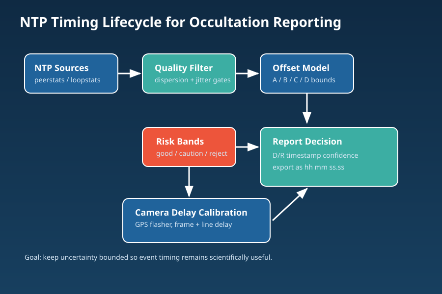

# NTP Timing for Occultations

## How almost anyone with a PC and camera can time occultations for free

- Audience: observers, beginners
- Focus: Easy installation and processes especially suitable for beginners

---

# Agenda

1. Why don't more people observe occultations?
2. NTP for PC timing
3. Installing NTP - NTP installer to the rescue!
4. Understanding NTP offsets and timing accuracy
5. When is NTP good enough?
6. Camera acquisition delays for cheaters
7. Measuring camera acquisition delays properly
8. Adding GPS receivers and flashers
9. Tools and Software
10. Wrapping up 

---

# Why don't more people observe occultations?

- No clear and easy path to follow. 
- High up-front cost.
    - Analog cameras and VTI. Complex, old tech. ~$500+
    - Astrid. All singing all dancing. Totally new workflow compared to typcial PC imaging. $700+
    - GPS cameras, QHY174GPS, DVTI-CAM. $1,200 plus.
- Complexity of hardware and softwared stops people early.
- Good news: a practical NTP workflow can be good enough for many events.

Goal of this talk:
- Make NTP timing practical, repeatable, and reviewable for beginners.
- Give a cheap and easy options for large scale campaigns and casual observers

---

# NTP for PC timing

- NTP keeps your PC clock aligned to UTC using Internet network time servers
- Software runs in the background automatically
- NTP monitor to understand timing performance

What to look for:
- Good quality servers with small delays (5-20 ms)
- Low jitter

---

# Installing NTP - NTP installer to the rescue!

- Single Installer:
    - Meinberg NTP
    - NTP Server Monitor
    - Configures National Standards Servers for 35 countries
    - Country specific pool servers
    - Optionally set up GPS receivers
    
- Quick, easy, no specialist knowledge required.
- NTP should be up and running in under 10 minutes

https://github.com/labstercam/occultation-ntp-installer

---

# Understanding NTP offsets and timing accuracy

- Run NTP Server Monitor to check performance
- Offset is the estimated difference between your local clock and the NTP server
- Delay is the return trip time to the server. Lower is better - preferably < 10 ms
- Delay is typically a few ms within you city, ~10 ms for 500-1,000 km
- Time error is by defintion no more than half the Delay
- In practice can be 2-5x lower, but <1-2 ms is practically impossible via home internet

---

# When is NTP good enough?

- Fibre connection to fibre network
- VDSL2 or VDSL likely not good enough (unless < 1-2 km to a fibre cabinet)
- Good quality servers choosen (the installer should do this)

Look for:
- stable delay and jitter
-  delays of 10 ms or less
- Rough estimate of likely error is 1/4-1/3 of the delay to selected server (*)
- Better estimate of accuracy in the SharpCap NTP analyser

If you are seeing delays of 20 ms or less and jitter of a few ms it will probably be good enough. But MUST check!

The offset doesn't matter as long as it is stable or drifts slowly.
The estimated error matters A LOT.

5 ms or so accuracy is good enough. 10 ms should be OK. 20 ms is perhaps too much and should add a GPS receiver.

---

# Camera acquisition delays for cheaters

- NTP can discipline the PC clock to hopefully 5 ms or so
- But there are still camera acquisition delays which can be 5-20 ms for a small sensor camera, or much larger for larger sensors
- Best practice is to measure these delays using a GPS flasher
- Very good estimates of line delay possible without flasher
    - max FPS corresponds to the total line delay for a rolling shutter sensor. e.g 50 fps max frame rate in SharpCap means it takes 20 ms to readout the sensor, and the per line delay is 20 ms/ total lines, e.g. 0.02 ms per line for a 1,000 line ROI.
- Frame delay itself cannot be measured without a flasher. Typically 1-6 ms but varies by sensor and ROI. For small sensors, small ROI it is usualy < 2 ms
- Could use measurements from other observers with the same camera

So for beginners, it is acceptable to measure line delay from max FPS for given ROI and camera settings, and add ~ 2 ms. 

Or get delays from other observers with same camera that have a flasher.

Warning! This only works for cameras where the USB connection is faster than the sensor readout. Cameras with USB 2.0 interfaces are NOT SUITABLE. Must be USB 3. Large sensor cameras (4/3 or larger) with ROI of more than ~6,000 pixel (WxH) likely not suitable unless a smaller ROI is used.

So use the smallest ROI that is workable with your telescope. Bin 2x or higher to reduce data rate, use MONO8 for colour cameras. 

---

# Measuring camera acquisition delays properly

- Use a GPS flasher in the optical path to measure true end-to-end timing.
- New tool in SharpCap to measure line delays automatically from live recording
- Works with any flasher or GPS receiver PPS output
- Calibrations for various camera settings stored for use in SharpCap tool so can be applied in TANGRA/PyOTE

Important: The line delays and acquisition delay vary with:
    - ROI
    - binning
    - bit depth / format
    - Tilt and Pan
- So repeat the measurements for all settings you will use.

---

<!-- _paginate: true -->

# Adding GPS receivers and flashers for better timing

## GPS Receivers
Simple to add GPS PPS or GPS NMEA receivers to NTP. The NTP-Installer streamlines the installation

- GPS PPS accuracy of <<1 ms in PC time
    - easy DIY build for $50
- GPS NMEA accuracy of a few ms in PC time
    - almost any GPS receiver, $20-50

## Add GPS flash timing to NTP

- Add GPS flash timing methods to get D/R accuracy of a few ms

Upgrade path:
- Start with NTP-only, then add GPS receiver of GPS flash timing  when ready.
- Or purchase a dedicated occultation camera and timer

---

# Tools and Software

## Core tools
- NTP-Installer - installs and configures NTP and GPS 
- SharpCap for line delay estimation
- SharpCap Line Delay measurement add-in for accurate line delay measurement
- Occultation-Manager SharpCap Add-in for event selection, recording and report generation.
- NTP accuracy analysis built into Occultation-manager

## Optional accuracy upgrades
- NTP Installer for guided setup and country-specific server presets
- GPS PPS receiver (higher clock confidence)
- GPS flasher (camera delay calibration)

## Recommended workflow stack for beginners
- Start: SharpCap + Meinberg NTP + NTP Server Monitor
- Next: add Tangra/PyOTE for extraction and reporting
- Upgrade: add GPS PPS/flasher when ready or 

---

# Wrapping up

- Most observers can start with a PC + NTP and produce useful timings.
- Prequisites are a good Fibre connection, and connection to good NTP servers
- No need to buy a new camera or timer or any additional equipment
- Camera acquisition delays can be estimated

Suiltable for beginners, casual observers, or large observing campaigns.

Suitable for observatories where changing cameras or adding equipment to the scope/camera is not feasible. Either NTP or GPS-PPS.

